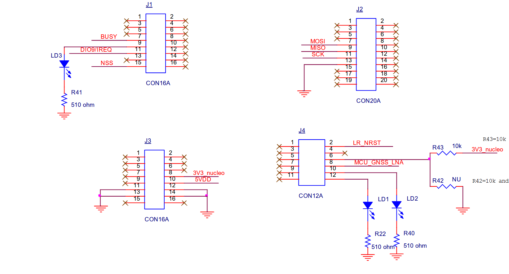
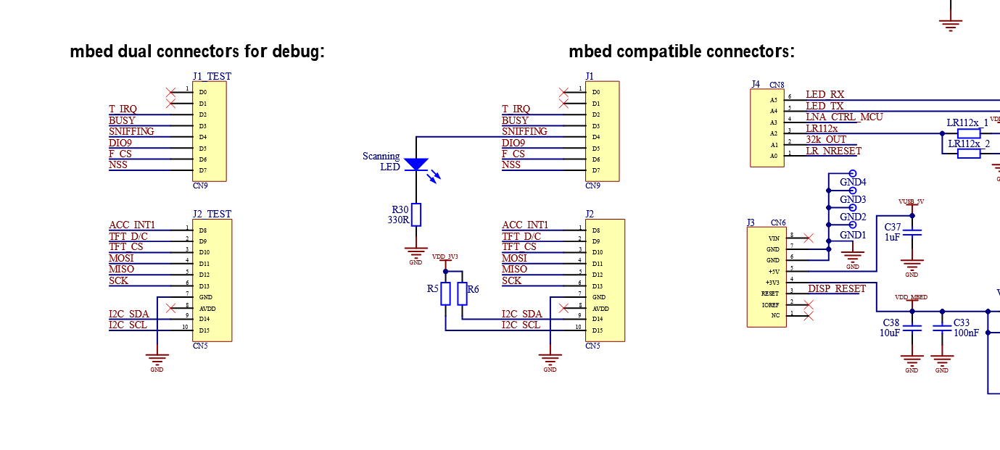

# Silicon Labs EFR32MG24 PORT of LR1121 modem Application Example

## 1. Description

Minimal port of the LR1121 modem application example project from [Semtech](https://github.com/Lora-net/ModemE_application_examples/)

### Porting Notes:

Generally all you need are the files in the Src/radio/lr1121_modem/src folder in the Semtech repo.  

You'll need provide the functions in lr1121_model_halxxx.c.

This project was written in one afternoon sitting and there may be some shortcuts taken (e.g. modifying the lr1121_modem_hal.c).  

### Hardware Used:

Silicon Labs [xG24-EK2703A EFR32xG24 Explorer Kit](https://www.silabs.com/development-tools/wireless/efr32xg24-explorer-kit?tab=overview)

I used [LBAA0XV2GT-001EVK from Murata] (https://www.murata.com/en-global/products/connectivitymodule/lpwa/overview/lineup/type-2gt)

it's been confirmed to work with the Semtech EVK as well: [lr1121dvk1tcks] (https://www.semtech.com/products/wireless-rf/lora-connect/lr1121dvk1tcks)

### Pre-requisits:
Connect the LR1121 to the ST NUCELO.
Connect the NUCLEO board to a host PC via a USB cable. The USB connection will provide power for the LR1121 Evaluation Kit as well as serve as a serial communication link for the download.
Drag-drop the L1121 Modem-E firmware (lr11xx-updater-tool_v2.5.1_modem_v2.0.1.bin) from (https://github.com/Lora-net/SWTL001/wiki) to the presented mass-storage drive. 
The serial output shows the Nucelo board flashing Modem-E onto the LR112.

Use a terminal application configured with the following settings:

*    Speed: 921600 baud
*    Data bits: 8s
*    Stop bits: 1
*    Parity: None

 ### Connecting the boards:
   
- Connect the LR1121 Board to your MG24 kit.
- Connect the wires according to Semtech Instructions. 

 

* J3-8  3V3 -> VBAT or 3.3V on the expansion headers
* J3-14 GND -> GND on the expansion headers 

Murata board to the MG24 explorer board.
* J1-7 BUSY -> PB00
* J1-11 Doi9 (INT) -> PB01
* J1-15 NSS -> PC00
* J2-7 MOSI -> PC03
* J2-9 MISO -> PC02
* J2-11 CLK -> PC01
* J4-2 RES -> PC08

### Compile and Run

Compile the SLS project in Silicon Labs Similicity Studio.  The version used is Gecko SDK Suite v4.4.5, but it should easiliy work with other versions.
   
Flash and run.

I believe the IO Stream output is going to Segger RTT.  You can use the console -> RTT tab of the Simplicity Command GUI to view the output.

 
